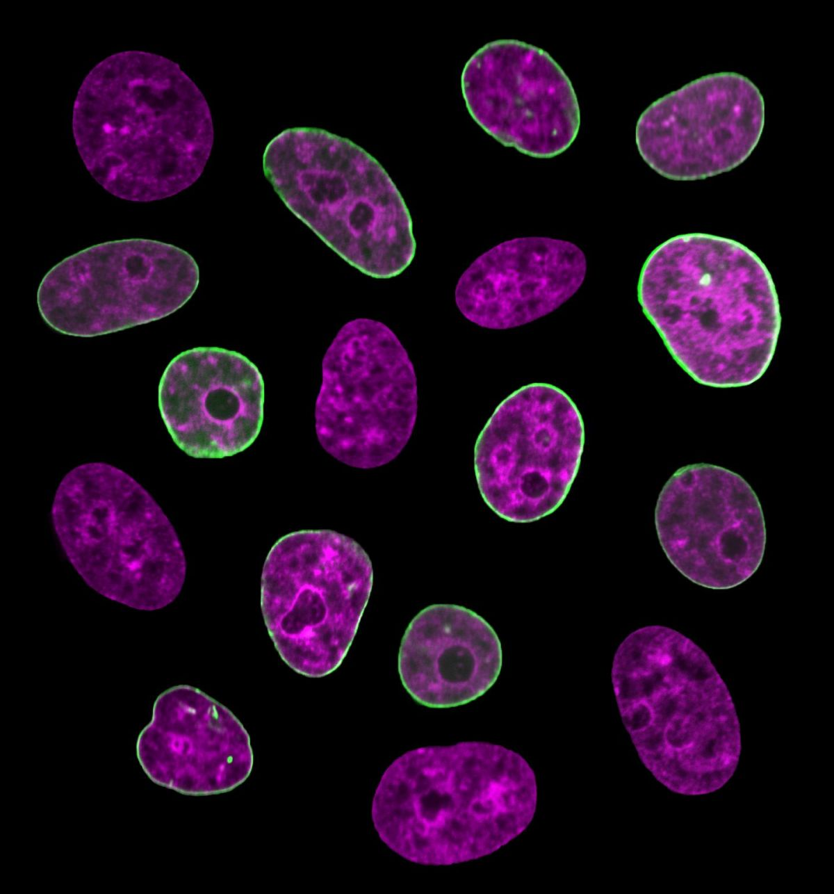

# 🖼️ Image Resizer – Nearest Neighbor & Bilinear Interpolation in Pure Python

Image Resizer is a simple, dependency-free Python tool that resizes images using two foundational techniques: **nearest neighbor** and **bilinear interpolation**. The project is built from scratch without using OpenCV or NumPy, demonstrating how image resampling works at the pixel level.

## 🔧 Features

- **Nearest Neighbor Resizing**
  - Fastest method; uses the closest pixel for each output point.
  - Produces sharp, blocky images when upscaling.

- **Bilinear Interpolation Resizing**
  - Smooths transitions by averaging nearby pixels.
  - More natural-looking results when scaling.

- Resize any image up or down with adjustable scale factors.
- Command-line usage for flexible input and output.

## 📂 Project Structure

```
ImageResizer/
├── resize/
│   └── resample.py            # Resizing logic: nearest_neighbor() and bilinear_interpolation()
├── output/                    # Output images are saved here
├── cell2.jpg                  # Sample test image
├── cells.png                  # Sample test image
├── run_resize.py              # Main script to execute resizing
├── dip.py                     # Provided image helper functions
├── requirements.txt
└── README.md
```

## 📸 Example Output

| Original | Nearest Neighbor (0.5x) | Bilinear (0.5x) |
|----------|--------------------------|------------------|
|  |  |  |

## ▶️ How to Use

```bash
# Resize using nearest neighbor interpolation
python run_resize.py -i cells.png -fx 0.5 -fy 0.75 -m nearest_neighbor

# Resize using bilinear interpolation
python run_resize.py -i cells.png -fx 2.0 -fy 2.0 -m bilinear
```

### Arguments
- `-i` : Input image filename
- `-fx`, `-fy` : Scale factors for width and height
- `-m` : Resampling method (`nearest_neighbor` or `bilinear`)

## ✅ Tech Stack

- Python 3
- Uses only built-in modules (`math`, `argparse`)
- No external dependencies

## 💡 What It Demonstrates

- Manual implementation of image interpolation techniques
- How resizing works under the hood
- Clean, testable code for image transformation
